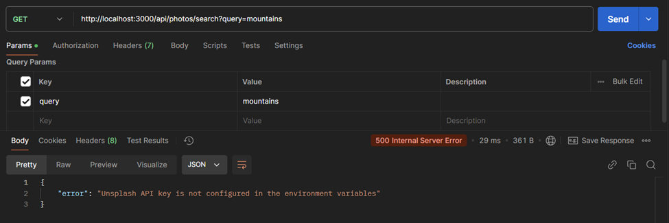
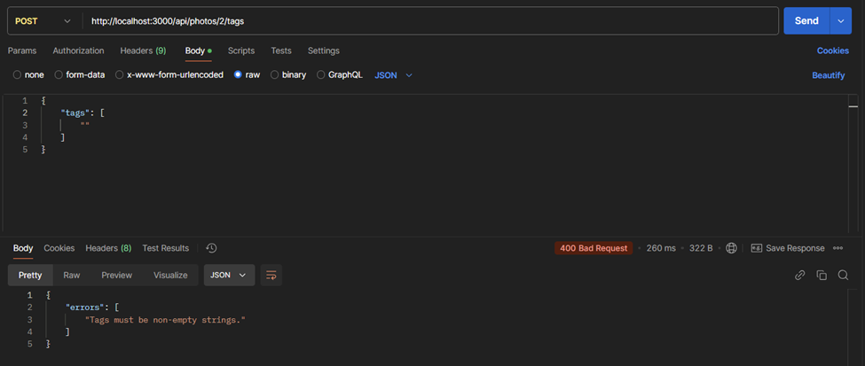

# 📸 Photo Curation App Backend 

## 📌 Overview  

This is a **photo curation app** backend that allows users to:  

✅ Search for images from the **Unsplash API**  
✅ Save images to **collections** in **Supabase PostgreSQL**  
✅ **Tag** photos for better organization  
✅ Search **photos by tags**  
✅ Track and retrieve **search history**  

The backend is built using **Node.js**, **Express.js**, **Sequelize**, and **Supabase PostgreSQL**.  

---
### Postman APIs Testing Screenshots

The API has been tested with Postman, and testing screenshots are included. [Screenshots](#testing-with-postman)

---

## ✨ Features  

- **👤 User Management**: Create and manage user accounts.  
- **🔍 Photo Search**: Fetch images from the **Unsplash API** based on search terms.  
- **📁 Collections**: Save images to Supabase database, organize them with tags.  
- **🏷️ Tag-Based Search**: Retrieve images based on specific tags.  
- **🕵️‍♂️ Search History**: Track and retrieve past searches for a user.  

---

## 🛠 Tech Stack  

| Technology       | Purpose                        |
|-----------------|--------------------------------|
| **Node.js**     | Backend runtime environment   |
| **Express.js**  | API Framework                 |
| **Sequelize**   | ORM for PostgreSQL database   |
| **Supabase**    | PostgreSQL database hosting   |
| **Axios**       | HTTP client for API requests to Unsplash API service  |

---

## 🚀 API Endpoints  

### 🔹 **User Routes**  

| Method | Endpoint         | Description            |
|--------|-----------------|------------------------|
| `POST` | `/api/users`    | Create a new user     |

### 🔹 **Photo Search Routes**  

| Method | Endpoint                      | Description                          |
|--------|--------------------------------|--------------------------------------|
| `GET`  | `/api/photos/search?query=xyz` | Search photos using Unsplash API    |

### 🔹 **Photo Collection Routes**  

| Method | Endpoint                      | Description                          |
|--------|--------------------------------|--------------------------------------|
| `POST` | `/api/photos`                 | Save a photo to the collection      |
| `POST` | `/api/photos/:photoId/tags`   | Add tags to a specific photo        |
| `GET`  | `/api/photos/tag/search?tags=xyz&sort=ASC&userId=1` | Search photos by tags and sort by date |

### 🔹 **Search History Routes**  

| Method | Endpoint                       | Description                          |
|--------|--------------------------------|--------------------------------------|
| `GET`  | `/api/search-history?userId=1` | Retrieve a user's search history    |

---

## Installation

### Prerequisites

- **Node.js** v16+
- **PostgreSQL** database (Supabase recommended)

### Steps

1. Clone the repository:
   ```sh
   git clone https://github.com/Deepak-Dalal/Photo-Curation-App-Backend.git
   ```
2. Navigate to the project directory:
   ```sh
   cd Photo-Curation-App-Backend
   ```
3. Install dependencies:
   ```sh
   npm install
   ```
4. Set up environment variables:
   - Create a `.env` file in the root directory.
   - Add the following:
     ```env
     DB_USER=your_db_username
     DB_PASSWORD=your_db_password
     DB_NAME=your_db_name
     DB_HOST=your_db_host
     DB_PORT=your_db_port
     PORT=your_port_number
     ```
5. Run database migrations:
   ```sh
   npx sequelize db:migrate
   ```
6. Run the development server:
   ```sh
   npm start
   ```

The API will be accessible at `http://localhost:<PORT>`.

---

## 🗄️ Supabase Database Schema  

Picstoria uses **Supabase PostgreSQL** as its database. Below is the schema for the tables used in the application.  

### 📌 **Users Table (`users`)**  
Stores user account details.  

| Column   | Type    | Constraints                  | Description          |
|----------|--------|-----------------------------|----------------------|
| `id`     | UUID   | Primary Key, Auto-generated | Unique user ID      |
| `username` | TEXT  | NOT NULL                    | User’s display name |
| `email`  | TEXT   | NOT NULL, UNIQUE            | User’s email        |
| `createdAt` | TIMESTAMP | DEFAULT now()          | User creation time  |

---

### 📸 **Photos Table (`photos`)**  
Stores images saved by users.  

| Column        | Type      | Constraints                   | Description                  |
|--------------|----------|------------------------------|------------------------------|
| `id`         | UUID     | Primary Key, Auto-generated  | Unique photo ID              |
| `imageUrl`   | TEXT     | NOT NULL                      | URL of the Unsplash image    |
| `description` | TEXT    |                               | Photo description            |
| `altDescription` | TEXT |                               | Alternative text for the photo |
| `dateSaved`  | TIMESTAMP | DEFAULT now()                | Date when photo was saved    |
| `userId`     | UUID     | Foreign Key (`users.id`)     | User who saved the photo     |

---

### 🔖 **Tags Table (`tags`)**  
Stores tags associated with photos.  

| Column  | Type      | Constraints                   | Description          |
|---------|----------|------------------------------|----------------------|
| `id`    | UUID     | Primary Key, Auto-generated  | Unique tag ID       |
| `name`  | TEXT     | NOT NULL                      | Tag name            |
| `photoId` | UUID   | Foreign Key (`photos.id`)    | Associated photo ID |

---

### 🔍 **Search History Table (`searchHistory`)**  
Stores users' search queries for photos.  

| Column    | Type      | Constraints                   | Description                  |
|-----------|----------|------------------------------|------------------------------|
| `id`      | UUID     | Primary Key, Auto-generated  | Unique search record ID      |
| `query`   | TEXT     | NOT NULL                      | Search term used             |
| `userId`  | UUID     | Foreign Key (`users.id`)     | User who made the search     |
| `timestamp` | TIMESTAMP | DEFAULT now()              | Time of the search           |

---

## 🛡️ Validations  

### ✔️ **User Registration**  
- Both `username` and `email` are required.  
- Email should be **unique** and **valid** (must contain `@` and `.`).  

### ✔️ **Photo Search**  
- The `query` parameter is **mandatory**.  
- Proper error handling if Unsplash API fails.  

### ✔️ **Saving Photos**  
- Image URL must be from **Unsplash** (`https://images.unsplash.com/`).  
- Maximum **5 tags** per photo, each **under 20 characters**.  

### ✔️ **Tag-Based Search**  
- Only **one tag** is accepted per query.  
- Sorting defaults to **ascending (ASC)** unless specified otherwise.  

### ✔️ **Search History**  
- Only fetches search history for a **valid `userId`**.
---
## 🔮 Future Enhancements  

### 🔐 **User Authentication & Authorization**  
- Implement **OAuth** authentication (Google, GitHub, Facebook) and JWT-based authentication.  

### ☁️ **Cloud Storage Integration**  
- Support for **AWS S3, Google Drive, or Supabase Storage** for saving images.  

### 🔎 **Advanced Search & Filtering**  
- Introduce **sorting options** and **fuzzy search** for better query matching.  

## Testing with Postman  

### Create User  
**Valid input**  
  

**Invalid email input**  
  

**Email already exists**  
  

**Invalid request body**  
  

### Get images from Unsplash  
**Valid request**  
  

**Missing query param**  
  

**Unsplash access key missing in the env file**  
  

**No images found**  
  

### Save Photo  
**Valid request**  
  

**Invalid image URL**  
  

**Invalid tags**  
  

### Adding Tags for Photos  
**Valid request**  
  

**Maximum tags**  
  

**Tags shouldn’t be empty strings**  
  

### Searching Photos by Tags  
**Valid request**  
  

**Invalid tag query**  
  

**Invalid sort query**  
  

### Tracking and Displaying Search History  
**Valid request**  
  

**User with userId doesn’t exist**  
  
